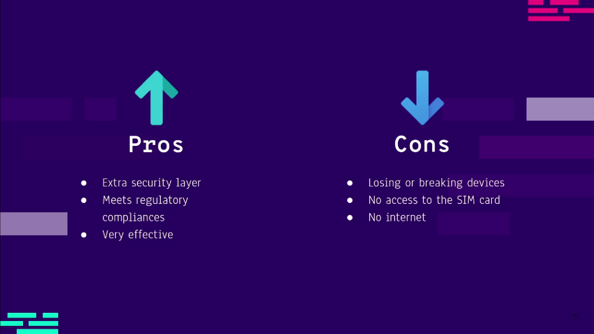

# [Web Authentication Methods](https://www.youtube.com/watch?v=LB_lBMWH4-s&ab_channel=SoftwareDeveloperDiaries)

**Web authentication methods are techniques used to verify the identity of users accessing web-based applications or services. These methods ensure that only authorized individuals can access sensitive information or perform specific actions. Username and Password is the most common authentication method, where users provide a unique username and a corresponding password to prove their identity. The server verifies the credentials against stored records and grants access if they match.In addition to the username and password, Two-Factor Authentication (2FA) requires users to provide a second form of authentication. This could be a code sent via SMS, a generated code from an authentication app, a physical security key, or biometric data (such as fingerprints or facial recognition).**

---

## [Cookies Authentication]()

---

## [JWT Authentication]()

---

## [Single Sign-On](https://www.youtube.com/watch?v=O1cRJWYF-g4&ab_channel=ByteByteGo)

**SSO enables users to authenticate once and gain access to multiple applications or services without re-entering their credentials. It relies on a centralized identity provider (IdP) that authenticates the user and issues security tokens to be used across various applications.**

---

## [Multi-Factor Authentication]()

**Similar to 2FA, MFA adds additional layers of authentication beyond just two factors. It combines different authentication factors, such as something the user knows (password), something the user has (security token), and something the user is (biometric data).**

---

## [Passwordless Authentication]()

---

## [Biometric with Web Authentication API (WebAuthn)]()

**Biometric authentication relies on unique physical or behavioral characteristics of individuals, such as fingerprints, facial recognition, iris scans, or voice recognition. It offers a high level of security but requires compatible hardware.**

