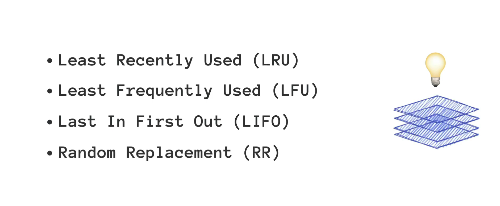

# [Caching](https://www.geeksforgeeks.org/caching-system-design-concept-for-beginners/)

**Caching is a system design concept that involves storing frequently accessed data in a location that is easily and quickly accessible. The purpose of caching is to improve the performance and efficiency of a system by reducing the amount of time it takes to access frequently accessed data. Caching can be used in a variety of different systems, including web applications, databases, and operating systems. In each case, caching works by storing data that is frequently accessed in a location that is closer to the user or application. This can include storing data in memory or on a local hard drive.**

Facebook, Instagram, Amazon, Flipkart these applications are the favorite applications for a lot of people and most probably these are the most frequently visited websites on your list. Have you ever noticed that these websites take less time to load than a brand-new website? And have you noticed ever that on a slow internet connection when you browse a website, texts are loaded before any high-quality image? Why does this happen? The answer is **Caching**.  
If you check your Instagram page on a slow internet connection you will notice that the images keep loading but the text is displayed. For any kind of business, these things matter a lot. A better customer/user experience is the most important thing and you may lose a lot of customers due to the poor user experience with your website. A user immediately switches to another website if they find that the current website is taking more time to load or display the results. You can take the example of watching your favorite series on any video streaming application. How would you feel if the video keeps buffering all the time? Chances are higher that you won’t stick to that service and you discontinue the subscription.

---

> [**Caching on the Backend**](https://www.youtube.com/watch?v=bP4BeUjNkXc&list=PL5Lsd0YA4OMFvX88T5xH93NqBALI7TENz&index=2) | [**Caching Blog**](https://www.geeksforgeeks.org/caching-system-design-concept-for-beginners/)
